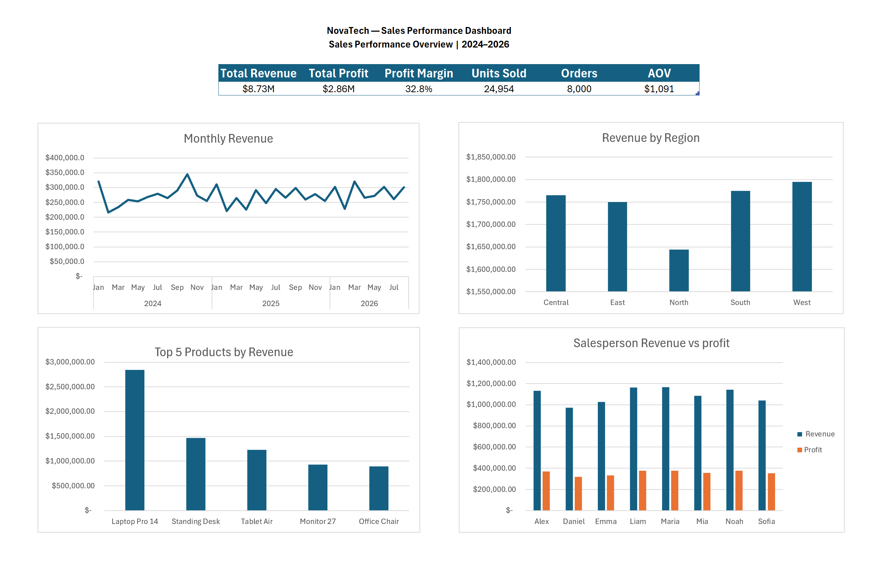

(DISCLAIMER: NovaTech is a completely fictional Enterprise)

# NovaTech Sales Performance Analysis

## Overview

An end-to-end sales analytics project built in Microsoft Excel and Power Query using a synthetic dataset of 8,000 sales transactions.

The project analyzes revenue, costs, profit, units sold, regional performance, product performance, salesperson performance, and monthly trends, then presents the results in an executive dashboard.

## Business Objective

NovaTech wants to understand:

- Overall sales and profitability
- How revenue changes over time
- Which regions perform best
- Which products drive revenue and profit
- How salespeople compare across revenue, profit, units, orders, and margin
- What actions could improve sales planning and profitability

## Tools & Skills

- Microsoft Excel
- Power Query
- PivotTables
- PivotCharts
- Excel formulas
- Data cleaning and transformation
- KPI development
- Exploratory data analysis
- Dashboard design
- Business insights and recommendations

## Data Preparation

The raw dataset contained 8,000 transactions and 12 fields.

Key cleaning steps included:

- Verified data types
- Trimmed inconsistent whitespace in the Region field
- Investigated missing Customer_ID values
- Checked the dataset for errors
- Preserved transaction-level records rather than removing valid sales
- Created a cleaned dataset for analysis

## Key KPIs

| KPI | Result |
|---|---:|
| Total Revenue | $8.73M |
| Total Cost | $5.86M |
| Total Profit | $2.86M |
| Profit Margin | 32.8% |
| Units Sold | 24,954 |
| Orders | 8,000 |
| Average Order Value | $1,091 |

## Key Findings

### Monthly Performance
Revenue shows significant month-to-month fluctuation, with no clear consistent upward or downward trend.

### Regional Performance
West generated the highest revenue and profit, while North generated the lowest revenue. Central had the highest profit margin.

### Product Performance
Laptop Pro 14 generated the highest revenue and profit. Mouse MX generated the lowest revenue but had the highest profit margin.

### Salesperson Performance
Maria generated the highest revenue and profit. Sofia had the highest profit margin, while Liam and Noah tied for the highest units sold.

## Business Recommendations

- Investigate the causes of large month-to-month revenue fluctuations and identify recurring patterns.
- Compare the practices of stronger and weaker regions to identify opportunities for improvement.
- Maintain focus on major revenue and profit drivers such as Laptop Pro 14 while exploring ways to increase sales of high-margin products.
- Compare high-revenue and high-margin salesperson approaches to identify practices that could improve both revenue and profitability.

## Dashboard

The workbook includes an executive dashboard containing:

- Revenue, profit, margin, units, orders, and AOV KPIs
- Monthly revenue trend
- Revenue by region
- Top 5 products by revenue
- Salesperson revenue vs. profit

- 

> Add a screenshot of the final Dashboard here when publishing this project.

## Workbook Structure

- `Clean_Data` — cleaned transaction-level dataset
- `Analysis` — overall KPI calculations
- `Monthly Analysis` — monthly revenue, cost, profit, and unit analysis
- `Regional Analysis` — regional performance analysis
- `Product Analysis` — product performance analysis
- `Salesperson Analysis` — salesperson performance analysis
- `Dashboard` — executive dashboard
- `Insights` — findings and business implications
- `Business Recommendations` — recommended actions

## Portfolio Summary

This project demonstrates an end-to-end workflow from raw data preparation through analysis, visualization, and business recommendations. It focuses on turning transaction data into information that a business decision-maker could use.
